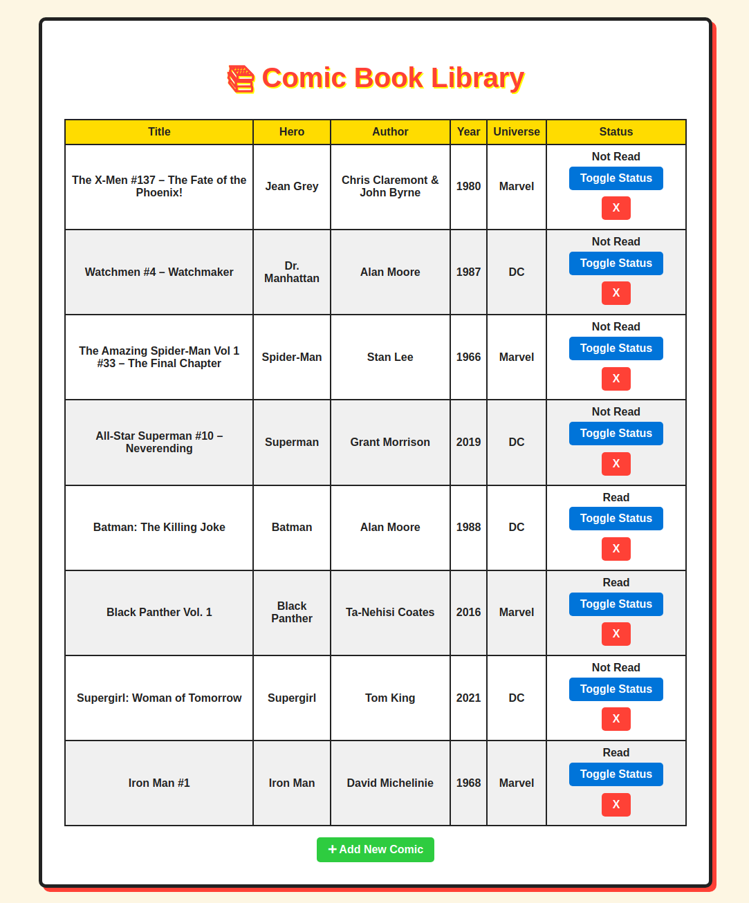

# Comic Book Library
## Overview
A simple comic book library application built as part of the Odin Project curriculum. This project allows users to manage a collection of comic books by adding, viewing, and organizing entries.

## Features
- Add new comic books with title, author, and genre
- View list of all comic books
- Basic organization and filtering (if applicable)

## Technologies Used
- HTML, CSS, JavaScript

## Installation
1. Clone the repository  
   `git clone <repo-url>`
2. Open `index.html` in your browser (or run any setup if applicable)

## Project Status
Completed

## Credits
Built as part of the Odin Project curriculum.
